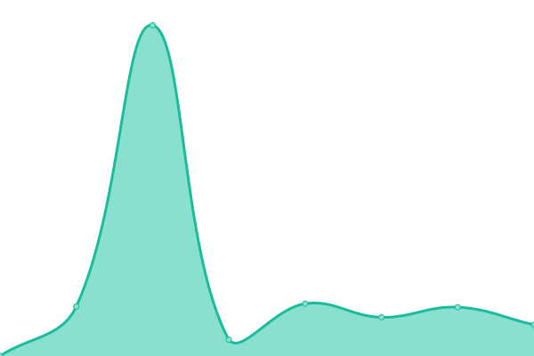

# [📈 Live Status](https://sewanee-raval.github.io/upptime): <!--live status--> **🟩 All systems operational**

This repository contains the open-source uptime monitor and status page for [Sewanee: The University of the South](www.sewanee.edu), powered by [Upptime](https://github.com/upptime/upptime).

With [Upptime](https://upptime.js.org), you can get your own unlimited and free uptime monitor and status page, powered entirely by a GitHub repository. We use [Issues](https://github.com/sewanee-raval/upptime/issues) as incident reports, [Actions](https://github.com/sewanee-raval/upptime/actions) as uptime monitors, and [Pages](https://sewanee-raval.github.io/upptime) for the status page.

<!--start: status pages-->
<!-- This summary is generated by Upptime (https://github.com/upptime/upptime) -->
<!-- Do not edit this manually, your changes will be overwritten -->
<!-- prettier-ignore -->
| URL | Status | History | Response Time | Uptime |
| --- | ------ | ------- | ------------- | ------ |
|  [Main Sewanee Site](https://new.sewanee.edu) | 🟩 Up | [main-sewanee-site.yml](https://github.com/Sewanee-raval/upptime/commits/HEAD/history/main-sewanee-site.yml) | 

 711ms
     
 | 

<a href="https://sewanee-raval.github.io/upptime/history/main-sewanee-site">100.00%</a>
    

|  [Library Website](https://library.sewanee.edu) | 🟩 Up | [library-website.yml](https://github.com/Sewanee-raval/upptime/commits/HEAD/history/library-website.yml) | 

 1525ms
     
 | 

<a href="https://sewanee-raval.github.io/upptime/history/library-website">100.00%</a>
    

|  [School of Letters Website](https://letters.sewanee.edu/) | 🟩 Up | [school-of-letters-website.yml](https://github.com/Sewanee-raval/upptime/commits/HEAD/history/school-of-letters-website.yml) | 

 454ms
     
 | 

<a href="https://sewanee-raval.github.io/upptime/history/school-of-letters-website">100.00%</a>
    

|  [School of Theology Website](https://theology.sewanee.edu/) | 🟩 Up | [school-of-theology-website.yml](https://github.com/Sewanee-raval/upptime/commits/HEAD/history/school-of-theology-website.yml) | 

 699ms
     
 | 

<a href="https://sewanee-raval.github.io/upptime/history/school-of-theology-website">100.00%</a>
    

|  [University Registrar Website](https://registrar.sewanee.edu/) | 🟩 Up | [university-registrar-website.yml](https://github.com/Sewanee-raval/upptime/commits/HEAD/history/university-registrar-website.yml) | 

 604ms
     
 | 

<a href="https://sewanee-raval.github.io/upptime/history/university-registrar-website">100.00%</a>
    

<!--end: status pages-->

[**Visit our status website →**](https://sewanee-raval.github.io/upptime)

## 📄 License

- Powered by: [Upptime](https://github.com/upptime/upptime)
- Code: [MIT](./LICENSE) © [Anand Chowdhary](https://anandchowdhary.com), supported by [Pabio](https://pabio.com)
- Data in the `./history` directory: [Open Database License](https://opendatacommons.org/licenses/odbl/1-0/)
